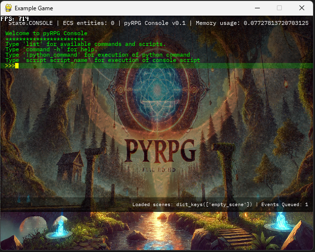
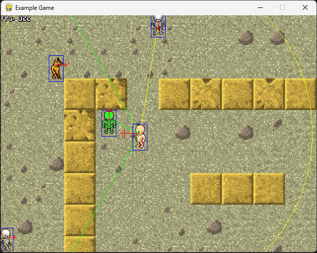
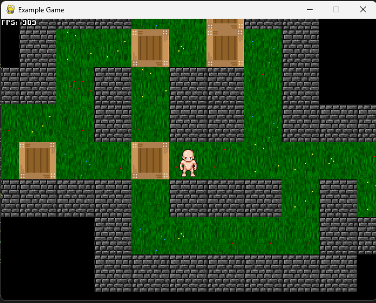

# pyRPG - ECS pygame Game Engine


pyRPG is a Python-based 2D RPG game engine built around an Entity–Component–System (ECS) architecture with strong emphasis on data-driven design, behavior trees, and event-driven gameplay. Game logic, AI behavior, scenes, processors, and even UI flows are primarily defined in JSON/YAML, enabling rapid iteration without touching engine code.

The engine is designed for experimentation with RPG mechanics, AI orchestration, and systemic gameplay rather than as a monolithic framework.



Currently, the documentation is poor. I would recommend to everyone to go through the number of prepared scenes, experiment, go through the json with scene definitions. **Learn by doing!** There is a lot of comments everywhere to help you out!

All of this is a result of me experimenting in my free time with Python and ECS paradigm. I was trying to find out what is possible to achieve rather than having clear goal in my mind. Many times the program can be written in much more optimized way. However, I prefered clearance and readability rather than performace. Hope that helps you explore the code easily!



## Key Features

 - Entity–Component–System (ECS) powered by Esper
 - Behavior Trees (BTrees) and command lists for AI logic
 - Event-driven architecture with JSON-defined conditions and actions
 - Data-driven scenes (JSON / YAML, with C-style comments)
 - Configurable processor pipeline per scene
 - Pathfinding distributed across game cycles (non-blocking)
 - Modular combat, damage, score, and destruction systems
 - Scriptable dialogs, windows, and UI flows
 - Multiple cameras and split-screen support

## Architecture Overview

### ECS Core

 - *Entities*: Lightweight IDs, optionally referenced by aliases in scene files
 - *Components*: Pure data containers (all components have JSON schemas)
 - *Processors*: Systems operating on component sets, executed in configurable order


## TODO list (messy)- not necessarily ordered by priority
  
  - [ ] - FOR CONSOLE - console scr scripts to support `//` comments
  - [ ] - possibility to decide if default.scr script or game menu should be loaded when running `python example_game/game.py` without parameters

  - IMPORTANT: if you want to display arming of the arrow then ammo pack(generator) and weapon must be 2 separate entities with 2 Renderable Models. If weapon and ammo pack are merged into one entity then only one renderable model (probably weapon) is displayed and the animation of arming an arrow is missing/overridden by weapon.

  - [ ] - optimize the following processors that consume the most time: `'GameEventsExProcessor'`: 1677, `'PerformRenderDebugInfoProcessor'`: 1657, `'PerformRenderMapProcessor'`: 1767
  - [ ] - in `PerformDisarmWeapon` component fire a new component for removing the WeaponInUse component. Maybe to have processor `RemoveRenderDataFromParent` + flag `FlagRemoveDataFromParent`(entity_ids) that will handle all the removals

  - [ ] - BUG - pickup `spear`(1) and next pickup `bow`(7). After bow pickup the spear texture remains lying on the ground.
    - the reason is that FlagDIsarmWeapon is not created when bow is picked up.
    - the `PerformArmWeaponProcessor` is triggering disarm only for the already armed weapon of type `bow` and no other. In fact this is correct. If I am arming bow and there is already another bow in the bow slot, I need to disarm the bow occupying the slot. And I do not want to disarm the spear as I an not trying to replace any weapon in the spear slot.
    - Also it is clear that RenderParentData component is closely repated to WeaponInUse component and no other. It is not relevant for arming/disarming but for manipulation with WeaponInUse component. When assigning WeaponInUse, I need to make sure that RenderDataFromParent is removed from all other weapon components (as I can only use one weapon at one time)

  - [ ] - Implement processor that will set WeaponInUse automatically when weapon is armed.
    - this should work also for the arm command - generates FlagWasArmed and as a reaction WeaponInUse will be created.

  - [ ] - BUG - weapon and ammo as separate entities, when bow is dropped, then ammo has texture on map.

  - [ ] - console commands to support UNIX-like patterns 
  - [ ] - add volume parameter to all sound effects and to all sound processors to take it into consideration
  - [ ] - fix json validation so that templates are not only strings but also the other variants
  - [ ] - add inventory to all test cases from 09 projectiles onwards
  - [ ] - in commands, check that some processors exists, otherwise the command will not be executed (disarming commands)
  - [ ] - implement `wear` processors

  - [ ] - showing of message should happen on camera not on window
  - [ ] - by pressing enter and esc on the exit dialog either confirming exit or dismissing the exit dialog.
  - [ ] - test recording to the file also commands and actions that are done in inventory - will it be recorded? 

  - [ ] - prepare some helping function that receives Position and Collidable component for 2 entities on input and returns if those collide or not. Similar for collisions with the map.

  - [ ] - improve the speed of generation of the map on the screen. 
  - [ ] - client/server game
  - [ ] - is it really necessary to have ecs_mng being passed to every command? Importing ecs_manager and checking if it is initiated should work just as well...

  - [ ] - music and sound volume into the configs
  - [x] - new camera processor `PerformScrollDelayedCameraProcessor` that implements delayed feedback effect of the camera. It is used for example in `tests/11_sensors/test_sensors_01.jsonc` scene and can be configured using `delay` parameter (how fast should camera convert to the real position of the entity with `Camera` component). 
  - [x] - music playback - new script `play_music` that can be triggered by event. Example usage is in `sokoban` game.
  - [x] - walls are entities - this resolves the problem with physicks of moving box into box into box and into the wall. Piloted with `sokoban` game. `ResolveMapCollisionsProcessor` is hence not needed.
  - [x] - cleanup functions are now using regular expressions. It is no longer needed to name every entity alias that you want to remove at the beginning of the scene. You can just use UNIX-like wildcard such as "wall*" to remove every entity with alias beginning with "wall". The same can be used for cleaning maps, handlers, templates and dialogs.
  - [x] - applying inventory command on empty slot results if disaster. Fix arm weapon command
  - [x] - prepare a new console command for the same getting _world.process_times - `proc_perf` command
  - [x] - have the time procesor statistics summed up accross all cycles, not just one cycle - because it is fragments of ms for each 
  - [x] - BUG - `FlagIsAnimationActionFrame` remains on player01 entity in arm weapon and ammo test scenes - removal processor was missing.
  - [x] - implement `arm_ammo` command + disarm ammo processors
  - [x] - BUG - in `test_arm_ammo_01` after picking upAmmo the game is frozen and ESC button needs to be pressed
  - [x] - BUG - fix always attacking in `test_arm_ammo_01` - probably not removed `FlagDoAttack` component
  - [x] - json validation for new components of `drop` and `disarm` systems
  - [x] - audio FX for arming a weapon
  - [x] - add messages about arming weapons to `test_arm_weapon_02` test scene.
  - [x] - BUG - in `test_arm_weapon_02` fragments of weapon sprites are being generated on the map after arming different weapon - this is because `RenderFromParent` component remains on the weapon entity even though it is no longer armed. Before arm command, disarm command must be executed to nice and clear remove the previous weapon. Only after nicely disarmed, the new weapon can be armed. Also disarm processor might be before arm processor (but this is probably not needed)
  - [x] - `arm_ammo` command and flow + disarm
  - [x] - BUG - in `test_arm_weapon_02` not disarming when dropping a weapon - fixed by putting the disarm processors in place
  - [x] - `ITEM_DROP` event enhance same parameters as `ITEM_PICK`
  - [x] - function to remove entity id from `HasInventory` categories - created in `dict_utils` function `del_dict_value`
  - [x] - BUG - Error in `test_arm_weapon_02` after arming by command, the entity is permanently walking - this was caused due to missing animation processors `PerformActionAnimationProcessor` and `PerformActionIdleAnimationProcessor`.
  - [x] - BUG - find out why there is no idle image for the bow - the action: idle was defined in the model, but it was pointing to empty image tile in the model spritesheet. Some spritesheets are special and need to be handled manualli in the Tiles SW. 
  - [x] - BUG - find out why attacking is never stopping - `RemoveFlagDoAttackProcessor` was missing
  - [x] - PREREQ is not halting when defined processor is missing. Why? - Because it was only logging warning and nothing else. Now I have changed the logic of `ecs_manager.create_processor` to raise `ValueError`.
  - [x] - missing some pictures in inventory (idle)
  - [x] - Divide the render inventory processor to 2 parts - command part (mouse) and render part
  - [x] - BUG - find out why in `test_pickup_03.jsonc` I can pickup more than 10 items
  - [x] - BUG - find out why the items are dropped on each other and not next to each other in `test_pickup_03.jsonc`
  - [x] - implement dropping of weapon/ammo that is armed - and for all inventory items - similar system to `pickup` system
        - `FlagIsAboutToDropEntity` + `HasInventory` -> `PerformDropProcessor` -> `FlagWasDroppedBy` + `FlagHasDropped` + event `ITEM_DROP`

  - [x] - change the `test_pickup_02` scene to the proper scene using templates for entities.
  - [x] - proper dropping of inventory items
  - [x] - Implement pause button to demonstrate the processor groups. SOme preocessors running and some stopped.
  - [ ] - Naming functions in `ecs_manager` can be better.
  - [x] - Finish getting key feedback into the `Controllable` component so that `toggle_control` can support it.
  - [x] - implement `PerformDisarmWeaponProcessor` and corresponding components and events

  - [x] - algorithm to find some free area to drop! for `PerformDropProcessor`
        - 8 positions for drop - randomly select one from it - sort them randomly
        - iterate all entities with Position component and Collidable component.
        - for all those check if the candidate position is colliding with some entity
        - additionally check if colliding with some tile
        - if all above is ok, place drop the entity there
        - if one of above is wrong, select from the next 7 positions and return the above
        - if you are at the last posiition and it cannot be used, place it there anyways.

  - [x] - BUG `test_pickup_02` scene. In case that 2 items are dropped and their collision areas overlap then there is brutal slow down. How to find out which processor is causing the slow down effectivelly? `GameEventsExProcessor` is the problem -> `event_manager._event_queue` is getting bigger and bigger. Console Command for seeing stats of `event_manager` and other managers as well.
        -  Every collision generates a record in `event_manager._event_queue` and the queue keeps on growing due to constant collision happening somewhere on the map. IMPLEMENT: that event queue must have some max capacity or events must have some TTL.
        - IMPLEMENT into console header/footer KPI the length of the event queue.
        - REVISIT the `process` and `ignore` mechanism of the `event_manager`. If process=SCENE_START then probably only these events should be in the event queue.
 
  - [ ] - BUG - `Position` component `x` and `y` can have float value in it, why???? Fix to int only
  - [ ] - Automate prep of configuration of fonts - now must be named one by one to add the path. Shoudl be automatic. Same with `init_fonts()`
  - [x] - Command `load_from_template` that will load any template with components on the entity.
  - [x] - BUG - Once unimplemented attack action button is pressed, all controll stops working for some reason  - `test_pickup_02` scene. Something wrong in the attack command - resolved: was missing `RemoveFlagDoAttackProcessor` and hence `FlagDoAttack` components that prevents movement was always there.
  - [x] - BUG - Fix the `collect_coins` game - currently it is reaching maximum of inventory items.
  - [x] - Some mechanics in `Controllable` component to switch between more profile of keys - one for controlling the character, other for controlling the movements in inventory. Resolution: `toggle_controls` command where you can define new set of commands for keys.
  - [x] - Pressing ESC in main menu leads to exit dialog
  - [ ] - in ECS manager change `delete_component` to `ecs_remove_component` to distinguish that this is Esper call and not my call
  - [x] - fix the debug font as there is no space between letters
  - [ ] - initialized for ECS manager and then use ECS manager imports for scripts/console scripts instead of main. But checking the initialized global first.
  - [x] - fork old version of esper and modify it (2025-07-15)
  - [x] - add logging to Esper, move component class into the ecs (2025-07-15)
  - [ ] - for state screens prepare some layout base on resolution config
  - [x] - prepare some dummy pytest file 
  - [ ] - `gui.py` refactor, maybe use GUIContext to represent window, window_manager, etc. 
  - [ ] - translations - json key:value in file, based on config, the specified file will be used print(trans("Some_text"))
  - [x] - multiple flow for processors (processor groups) depending on game state (so that inventory can be implemented) (2025-07-15)
  - [ ] - Refactor all `core/scripts/*`. Import not `main` but `ECSmanager`. In `initalize` function check that ecs_manager is initialized. Import `main` only where it is really used, for example `exit` command.
  - [ ] - BUG - debug information upon hover raises error when trying to render the frame
  - [x] - GitHub actions clean pytest, doctest and Lint issues.
  - [x] - Make messagess work. Sript `add_msg` is corrupted. Plan the necessary processors handling message queue.
  - [x] - Change the scenes that are single screended to use `screen_fill` parameter of `Camera` component in order to keep whole screen filled after resolution change. (2025-07-07)
  - [ ] - Settings screen option running in some dialog and having some Apply button. Problem that CHeckBox within UIWindow hiding is raising exception.
  - [x] - How to go back from the settings screen to the Game? resume button. (2025-07-07)
  - [ ] - dict_utils including getting dict from file as a package
  - [ ] - main.reinit() function do it more universal - select what all you want to reinit
  - [ ] - make the check of state changes optional with only warnings being displayed and not preventing the change of state completely.
  - [x] - adjust the progress bar based on the window resolution
  - [x] - rename `engine.new_game` to `load_scene`
  - [x] - pass progress bar form `load_scene` to `load_scene_from_file` to `load_scene_from_def`
  - [ ] - clear the `engine` code from unused things
  - [x] - rename `QUEST_START` event to `SCENE_START` event (2025-07-07)
  - [ ] - parameter that decides whether to show the loading progress - was there some time ago already, now gone
  - [ ] - console command that just toggles off the console + implement parameters to the commands not to toggle off console at the end to use with more complicated console scripts.
  - [ ] - toggle console without animation effect in an instance, one cycle without console and then back to the console - how to call all processors for one cycle
  - [x] - Start into empty console and run console script that loads the scene and everything - the complete load managed by the console script
  - [x] - prepare `load_scene` console command
  - [x] - prepare empty scene and load into it - just showing background picture
  - [ ] - Console hight should be dynamically calculated min(displayable_lines, display_lines from config)
  - [x] - BUG - After calling console_command `change_res` the exit screen is not displaying the exit dialog (the MENU)- chaos in states and menus (2025-07-16)
  - [x] - BUG - logs are emptied after the console `change_res` console command
  - [x] - BUG - console command `get_components` does not work properly
  - [x] - BUG - console command `get_processors` does not work properly
  - [x] - BUG - console command `set_value` does not work properly
  - [x] - Get rid of displaying console welcome message when console is re-initiated during for example changing of resolution.
  - [x] - BUG - after executing change_res console command, the state of the game is START_PROGRAM, also the console is not toggled off.
  - [x] - BUG - toggle console causing automatic keypresses after the console is toggled again - fixed by clearing the console keypressed cache during toggling.
  - [x] - BUG - `exit` console command does not end the game - fixed by allowing transfer from CONSOLE to END_PROGRAM state
  - [x] - BUG - `list` console command - registered commands go away after reinit of console
  - [x] - Console commands as script file - similar to game commands - initialize, keep list of commands ... Probably part of the Console solution ...
  - [ ] - comment properly the COnsole code - changing the app leading to revidion of text_params in the header and footer
  - [x] - get rid of timed - should be part of the config and not passed around as a parameter
  - [x] - change width of the console from separate function
  - [x] - implement reload in console - changing CLI, Paths, ... maybe just adjust the same init function ... using _INIT ...
  - [x] - remove WIDTH and HEIGHT, keep only resolution
  - [x] - GUI manager after calling init is deleting the background with the game - do it so that background is kept
  - [x] - console manager after init is deleting all history from console. Probably do some separate function `on_display_changed`
  - [x] - after reinit of the console, history is kept but the lines ar not divided correctly according to the width


## Features
  - [ ] Implement some shaders based on the video from DaFluffyPotato on youtube
  - [ ] Implement Showing weapons in the game
        - Once you go into inventory and select a weapon and press ACTION button, the weapon is automatically selected and armed.
        - Once you go into inventory and select an ammo pack and press action button, the ammo pack is automatically armed.
        - Create a new command for arming in Inventory.
         - But first recognize in RenderInventory if Weapon and if AmmoPack.

        - [ ] Implement `FlagShowWeaponary` with details about the displaying
        - [ ] Upon having `HasWeapon` component show the slots - for weapon and for generator
        - [ ] Upon having `WeaponInUse` component, show which weapon is selected
        - [ ] Drag weapon (`Weapon`) and generator (`AmmoPack`) from Inventory to weaponary

  - [ ] Implement inventory 
        - [x] Possibility to have different set of processors for different States
        - [x] Implement new component `FlagShowInventory`
          - can calculate the dimensions of inventory window based on `Camera` component (+reinit)
        - [x] Implement new command `toggle_inventory` that after pressing an inventory key creates/deletes `FlagShowInventory` component + manipulates the `Controllable` component - disabling the controls or assigning different commands to them
          - [x] in order to toggle inventory, I must be able that some keys should react on key up and not key down event. Otherwise the command will create and delete FlagShowInventory component many times before I lift my finger off the key.
        
        - [x] Prepare new command `toggle_controls` to enable/disable/exchange commands behind pressing of the keys
        - [x] Prepare new scene to test the inventory
        - [x] HasInventory must have also information about displayed inventory - apart from set also a list with 10 positions filled with `None`s.
          - [x] Modify `HasInventory` to have the information in a form of a list.
        - [ ] How to prevent pickable entity from being picked immediatelly after it was dropped?
        - [ ] Throw item out of inventory
          - [ ] Implement remove function in HasInventory to safely remove from categories. Add it to dict utils.
        - [ ] Show information about the item in the footer
        - [x] Prepare commands for moving around the items in inventory using the arrow keys.
           - [x] `toggle_controls` command must support also change in the key feedback schema 
        - [x] Drag also to the empty slots
        - [x] Adjust control component to support switching for alternate controls and control the inventory with arrows
          - [x] new methods in `Controllable` component. `set_control_cmds` and `revert_control_cmds`
        - [x] - Change the inventory so that `load_from_template` new command is used for change of controls. Prepare new templates for game controls and inventory controls.
        - [x] Do not show the debug information while dragging
        - [x] Show picture of item while dragging centered on the cursor

  - [ ] many custom ProgressBars available and can be sellected in the scene file by configuration - for example
  	`"progress_bar": ["gui:SimpleProgressBar", {"background": "splash_pyRPG.png", "bar": true}], // example how progress bar could be configured`

  - [x] BUG - DISPLAY["SHOW_FPS"] is not taking configuration from config.jsonc
  - [ ] new `ALL` option for cleanup actions - some new wrapper functions will be needed
  - [ ] Some problem with `tests/12_ai/simple/do_parallel.jsonc` when enemy approaches
  - [x] Show FPS also i fullscreen mode (config parameter)
  - [x] Branch - Fix console and make it more usable. It contains very old descriptions.
  - [x] Fix running in 1920x1080 fullscreen - how to tell video component to get the system configuration - to cover the full screen?

## To Do

  - [ ] `do_parallel` to support skipping of cycles so that some commands run once per some amount of ticks and meanwhile return some default value
  - [ ] prepare `test_bb_value_in` and `test_bb_value_not_in` as a faster alternatives to `test_bb_values` that is using potentionally slow json logic
  - [ ] blackboard having implicit value `self` referencing the entity ID or name - can be then used in all handlers
  - [ ] new command based on experience with `do_parallel` - `do_if_bb_test_true`
  - [ ] Behavior Tree and Behavior list - implementation of restart function - tree/list starts again from scratch. Useful for restart of the whole tree if some event comes.
  - [ ] Make scripts runnable from the console
  - [x] Rename quests to scenes. Scene is more common name for what the engine is defining in the json files.
  - [ ] Every game/test using scenes should be defined outside of pyRPG folders and only import pyRPG and use its parts. No direct changes in pyRPG folders and files.
  - [ ] Make scripts more nice - now they are using mainissing logging, missing description. Missing concept when to use commands and when to use scripts, make them work from console...
  - [ ] finish tests and json definitions for new commands

## Bugs
  - [ ] BUG - move_to command makes the NPSs to walk through the tiles
  - [x] BUG - entity is moving to the second point in the path not the first point in the path! That is causing problems when only chekcpoints are moved. Entity is not avoiding obstacles under those circumstances.
  
  - [ ] BUG - move_to_pos_target_vect - direction of movement (facing of entity is not being changed)
  - [ ] BUG - Problem with pushing entities into walls - eventhough map collisions are enabled. To be fixed.
  - [ ] BUG - debug processor works onlywith one camera
  - [ ] BUG - when restarting scene in the `collect_coins` game, there is loading screen in the background

  - [x] BUG - Progress bar is showing `number / None` - fix is problematic for unknown reason (closed 25.6.2025)
  - [x] BUG - The configurations are not properly merged when merging nested dictionaries - fix needed
  
  - [x] BUG - Template from existing entity using # ... add entities also into storage=self._template_definitions

  - [x] BUG - Updating of existing entity (created in some scene before) does not work. Instead, completely new entity is created!
  - [x] BUG - When collect coins or sokoban ends it cannot start again for some error - fix it
  - [x] BUG - at the moment cannot controll other entity as the `entity` parameter is poped from the command `params`. As `params` is mutable dictionary, it is removed everywhere. As a fix, either add `entity_id` into the `Command` namedtuple or do not `pop` the entity parameter, just read it.
  - [x] BUG - seems that `ECSManager` does not translate references to aliases that are lower in the scene file. It would be needed to add new item to the `engine.load_scene_def_fncs` that will call some `create_empty_entity` over all entities first and then calles `update_entity` over all (2 step process, now it is just one step).
  - [x] BUG - Dialogs stopped working - because engine.py imports QuestManager and QuestManager imports Scene scene.py imports scripts  (for get_script_fnc) and there are all scripts imported - we need to have script same as processor - define it at JSON string
  - [x] BUG - when shooting arrow the entity moves down - fixed by adding `accept_pos_fix_from_denylist=["ALL"]`
  - [x] BUG - NPC is destroyed but the brain still works - as a result it is lying dead and moving forward
  - [x] BUG - when there is no command assigned to ACTION button, the controlls freeze after pressing z button - None command must be assigned in Controllable component
  - [x] BUG - on the map the second layer is not transparent but has black background - update pyTMX helped
  - [x] Bug - btree problem when the tree should run again - for example with usage of the `Repeater` node. Fixed. It was caused by the `btree._action_node` not reseting to None when the `Repeater` reset the whole tree to run it again.
  - [x] BUG - fix `play_commands_01.jsonc`

## Features - to rearange
  - [x] Implement handlers into behavior tree definitons - handlers will just pu, is it ok? Mt some value from the event on the blackboard. Done - now handlers can be part of components (or basically anywhere in the scene definition. Only the engine code needs to be slightly adjusted). Script `set_bb_key` was prepared to set blackboard value and can be used in the handlers.

  - [ ] Move the processors that are removing the temporary Flag components before the processors that generate Flag components. To ensure that the Flag component is available for all processors, even for those that are before the generator processor.
  - [ ] Instead of ecs_mng return group of functions from the engine - not only for ECS manipulation but for other purposes as well. For example for executing commands, processing events, getting path from the map or pathfind manager etc.
  - [ ] When some command is internally calling other command, all ctx.locals are put on one place - that can be chaotic. It would be great to have some way to distinguish in which command the ctx variable was created.
  - [ ] COnsider changing of notation on command variables - camel case instead python snake case - for clarity.
  - [ ] implement AStar algorithm for pathfinding and DFS algorithm.
  - [ ] possible to load any map, not only 64x64 and use it with any textures of characters - 128*128. Pixel space vs. tile space vs xxx
  - [ ] redo rendering of the tileset - quick algorithm that is using maximum of what has been developed in previous frame and only renders changes.
  - [ ] AI kill them all game
  - [x] path finding using checkpoints on the map and BFS from source and target
  - [ ] doctest on command files - process tests calling always `init` as prerequisite
  - [ ] tile_to_px function and px_to_tile function store somewhere and use it universaly - now haviong it in commands and debug processor at least.
  - [ ] adjust BFS pathfinding so it prefers right-left up-down movement based on the greater distance to the target.
  - [ ] write test to `move_to_target`, `face_entity`, `test_bb_value`, `set_bb_value` commands, then merge the branches


  - [ ] Make universal loader that takes full path, partial path, with or without suffix - all possible options - RenderableModel path, templates path, SOund path, vfx path
  - [ ] Extend sound effects - SoundFXOnGeneration - generator produces sound - shooted arrow
  - [ ] Person can generate many sound effects at once - damage and no health and collision and footsteps - how to stop playing damage sound when no health?
  - [ ] Extend Visual FX - VisualFXOnGeneration - for weapons, VisualFXOnCreation, VisualFXOnDamage, VisualFXOnNoHealth
  - [ ] Implement post-requisities on processor and change the process of processor loads - 1st load all processors without checks, 2nd check prerequisities for all proc 3rd check post-requisities for all proc
  - [ ] there is many managers - what about having list of managers and every manager inherits from some abstract class things like `clear()` or `register()` methods. By doing that clearing will be easier done by iterating the list and also can be part of the progress bar.
  - [ ] maybe the ProgressBar might be created in the Game class only and not in the Main class. By doing that, I will pass one less argument to the engine.
  - [ ] option not to scale-up the render models to 64x64
  - [ ] optimize  `map.get_tile_images_by_rect(layer, camera.map_screen_rect)` function. there are unnecessary calculation being done every cycle - tiles to show
  - [ ] Revise usage of `dict.get()` because it is always returning None if value is not found. Sometimes I want the `KeyError` when the key does not exist and not `None`.
  - [ ] Rename create_entity_ex to create_entity
  - [ ] Implement smooth camera moves. When player stops the camera slowly slows down till centred on the player
  - [ ] Implement ordering of displaying of entities based on their Y position. Entities with lower Y should be generated on the display before entities with higher Y
  - [ ] How to implement that some map layer elements are displayed before entities and some behind entities
  - [ ] find all places where we are loading a dictionary and use functions.get_dict and functions.get_dict_params functions
  - [ ] Implement `ALL`, `` into the cleanup at the beginning of the scene definition - ideally some pre_processing that will substitute keyword ALL with all the processors in the
  - [ ] Possibly substitute 'id' key from scene file on entities for 'alias'. To make things more readable in the code and not to mismatch
  - [ ] schema validation path to every test scene
  - [ ] Unit tests for BTree and BList
  - [ ] implement `toml` format for easy scene definitions (same as currenlty used `yaml` and `json`)
  - [ ] implement test scenes for testing of the new commands with the command context.
  - [ ] Implement new component `CanHear` that will specify what the entity can hear and will hold list of entities that are being heard.
  - [ ] it would be nice to have left mouse click and right mouse click mapable in the `Controllable` component to some commands. For example by left click, there will be new brain sequence that will move the character to the target.
  - [ ] btree_test.py failing - try to fix the error with templates
  - [ ] dialogs to be more easily used as a templates
  - [ ] Bug in `test_arm_ammo_01.json` - once you press attack, no other commands are processed
  - [ ] `FAILSAFE_TREE` and `FAILSAFE_LIST` put into config file outside of `Component` classes. Also, unify with default key_commands - those should be in configuration probably as well.
  - [ ] create tests for recording and playback of commands - put out generator value, it is not important.
  - [ ] Add JSON schema definition to all new movement commands px, tile, move_to
  - [ ] Add tests to all new movement commands px, tile, move_to
  - [ ] Revise map class - using pygame.Vector2 instead tuple and list
  - [ ] Position component to use Vector2 from pygame and all game to use Vector2 for pos_px and pos_tile variables
  - [ ] pygame.Vector2 to be used everywhere where possible
  - [ ] Try to implement `move_to` command as a `btree` rather then encapsulate all logic and path points into the command itself. Then compare those 2 approaches. 
  - [ ] Write more mocs to components and managers
  - [ ] Consolidate the packages so instead of the `from pyrpg.core.ecs.components.new.position import Position, PositionMock` we can import as `from pyrpg.core.ecs.components import Position, PositionMock`
  - [ ] In case of error, load some mock - test map instead of real map, test sound instead of real sound, test model instead of real model, test AI instead of real AI
  - [ ] Change of map rendering - do not always generate all the tiles from scretch but - re-use the pane and only draw the tiles that are new + re-draw the animated tiles if needed.
  - [ ] How to solve the problem when AI follows some path and is attacked? The easier way is probably to reset the BT as a part of event handler, not sure.
  - [ ] ECS manager will provide only `_game_functions` to processors and commands and nothing else. Thus, we would need to pass the whole `ecs_mng` reference to the commands but only `ecs_mng._game_functions` (dict of references)

  - [x] Is quest manager used? remove it
  - [x] Rename `quest` to `scene` everywhere
  - [x] Get rid of new and dots in configs below "MODULEPATHS": {"SCRIPT_MODULE_PATH" : "core.scripts.new.", "COMMAND_MODULE_PATH" : "core.commands."
  - [x] Implement logger also for the configurations 
  - [x] reduce number of files in `collision_system` delete some of them and merge necessary version of classes to the existing files `generate_collisions_processor.py` and/or `resolve_collisions_processor`
  - [x] update collision processor according to the new concept and document it
  - [x] write documentation how to add new component/processor class without the need to change all the dependencies - multiple classes in the files
  - [x] Solve creation of arrow/sword swing so that it does not move player and the player does not need to have accept_pos_fix_from_denylist set to [ALL]
  - [x] Prepare all weapons in some test scene - to test the factory functionality
  - [x] JSON schema - every component can have one 
  - [x] JSON Schema for the whole scene
  - [x] Prereq extension so that it supports `and`, `or`, `oneOf`, `anyOf`

  - [x] Prepare script module that implements YES/NO decision + IF json logic - custom event generation and catching the event in the event handler
  - [x] Prepare script that restarts the scene - clear all scene and loads specific scene
  - [x] Reimplement QuestManager so it manages the loading of all scenes data and distribution to other Managers, 
  - [x] *Also reimplement EventManager to manage all the handlers loaded from the scenes*.
  - [x] rewrite conditions and actions upon events into JSON logic format
  - [x] loading game on GUI using threading library
  - [x] implement Sokoban-like game - moving the boxes is ok, when box is landed to the correct spot, it changes??? How to implement that?
  - [x] rewrite commands so that code in the package is not needed and commands register themselves with the command manager
  - [x] implement that the processors are not running in every cycle - some nice implementation for all processors in esper probably would be nice

  - [x] Template not only from files but also from previous entities definition in the scene file - implement copy entity method, maybe on esper level. Then use it in scene definition.
  - [x] Load all entities synonyms at the beginning so that entity names can be used in all component definitions
  - [x] Rewrite all event handling conditions in tests to JSON LOGIC.
  - [x] Fix the map layers that are not transparent - Upgrade to new pyTMX version helped
  - [x] Possibility to update entities in the scene definition - adding new components to already existing entities.
  - [x] Possibility to update entities in the scene definition - deleting components on existing entities.

  - [x] Remake ecs manager so that it contains some get processor function that translate processor string into class. And redo load processor and delete processor to use this new function
  game. By doing it this way it will not be necessary to modify the logic of ecs_manager's delete_processor.
  - [x] Redo prereqs in the scene manager - the load is ugly
  - [x] Implement new component `CanSee` that will specify what the entity can see and will hold list of entities that are being seen.

  
  - [x] in `generate_command_from_XXX_processor` there is repetitive part that is extracting entity_id from the parameters or from the brain owner and putting the command into the queue - this common part can be abstracted into separate function and called separatelly. Alternativelly it can be transfered from processors to `command_manager.add_command` function. 
  - [x] problem that the first movement eventhough by small step is doing huge leap by using `FlagDoMove()` this is because the first `dt` is huge. Has been solved by redoing the first `dt` calculation directly from the `max_fps` value and moving the `dt` calculation at the end of the `main.run` procedure.
  - [x] implement a new FlagDoMove feature that does not take into account `dt` value and always moves by specific amount of pixels, steps. Prepare also new command for that. It is useful for movements of NPCs because using of `dt` correction might lead to unpredicted steps/jumps in the NPC path.

  - [x] Every command should hae its JSON schema definition

  - [x] redo doctests for all commands (cmd_ctx was substituted by ctx) - `move_to.py` and onwards
  - [x] redo `CommandContextMock` so that it does not need to be initiated as `CommandContextMock(globals=ContainerMock(), locals=ContainerMock())` but as `CommandContextMock()`
  - [x] move_to_target command - that is calculating the path
  - [x] move to range and attack with arrows example using path finding and attack command.


## Dev Log - some years missing

### 2024-06-28 First prototype of behavior tree using events to modify the Brain's blackboard value
  - Now, the behavior of the NPC can be changed upon receiving the event. For that to happen, handler for that event must be defined to change the blackboard value of the NPC's brain. NPC's brain must contain tests that are checking the blackboard value for changes and processor for handling the needed events must be set. Example of such scene is `guard_and_fight_back_if_ambushed_using_events.jsonc`.
  - The definition of such behavior is more complicated, but it is more universal and does not require specific commands for specific tests.

### 2024-06-25 Handlers now can be defined as a part of component parameters
  - To make the definition of handlers more readable, it is now possible to include handlers deinition also into the component `params` dictionary. It is good to have event handlers defined on the same place as `BrainAI` definition so that the behavior tree and event handlers that are modifying the blackboard are in the same place in scene specification.

### 2024-06-25 New get_coll_value function to search values in the collection
  - The function is located in `pyrpg.functions.dict_utils` package and is capable of returning values from collections as an generator.
  - It was developed to facilitate getting and loading handlers from different places in the scene definition (used in `engine` module).

### 2024-06-21 New test_damaged and test_can_see commands inplemented
  - the `test_can_see` commands is using the `CanSee` entity for getting the list of entities in sight. If there is desired entity in sight (command parameter) then the command succeeds. Can be used in behavior tree inside the `do_parallel` command to check for enemies during movements and consequent attack or running away - check also the test scene `guard_and_attack_on_sight`.
  - the `test_damaged` command is using `FlagWasDamagedBy` to determine if the entity was damaged and by whom. The attacking entity can be stored on the blackboard and further use in the brain logic. Check aslo the test scenes `test_damaged` and `guard_and_fight_back_if_ambushed`

### 2024-06-07 New test_bb_value and log commands implemented
  - the `test_bb_value` command lets you test the content of the global blackboard using the json expression such as `["!=", ["VAR", "target_ent"], 0]` (if the value target_ent on the blackboard differs from 0 (true) then return `SUCCESS`. Else, return `FAILURE`)
  - the `log` command simply puts any text on the console output. It is usefull when debugging a command generators

### 2024-06-07 New do_parallel command that enables parallel execution of multiple commands
  - Newly, there is the new `do_parallel` command that can take definition of many commands as the argument and the mapping of results to expected result.

### 2024-05-17 Commands can use path finding that is distributed in several game cycles
  - Newly, there is a new `PathfindManager` that registeres all the requests for calculation of some path, gathers all the requests in a queue and calculates the paths in organized way. It can be for example set, that only specified amount of path search cycles can be performed within one game cycle in order to avoid freezing of game due to large calculations.
  - Newly, there is new processor in the `CommandSystem` called `PerformPathfindingCalculationProcessor`. This processor invokes `continue_search` method of the `PathfindManager` and hence calculates part of the paths.
  - Newly, commands can request calculation of the path (typically in their `init` part) and ask in the `process` part whether path calculation is finished or is still running. Once it is finished, they can use it. CHeck the `move_to` command implementation for an example.

### 2023-09-30 Fixed usage of aliases in all scene definitions
  - Previously, it was not possible to use alias in the scene file definition, if the entity representing this alias was not yet created (was defined lower in the scene file than in was used).
  - Newly, alias can be used anywhere in the scene file. Even if the entity is defined last in the scene file, it can be referenced by the entity that is defined first in the scene file.

### 2023-09-07 Commands and Command Generators Redone
  - Newly, logic can be defined by `btree` or `blist`. Commands can be used in both structures. Both structures follow `CommandGenerator` prototype. In future, no problem to add more structures that will follow `CommandGenerator` prototype.
  - Newly, `Command` namedtuple consists of `name`,`params` and `entity_id` attribtes. Those 3 attributes reflect the information from the `scene` definition. Specifically, `entity_id` marks the optional parameter specified in the scene on which entity the command must be executed. It is hence possible for the player entity to issue commands (for example via `Controllable` Component) to other entity such as NPC. Useful for global brain entity that can issue commands to different entities and hence orchestrate the action in the game.
  - Newly, all commands have as a parameter `Command`, `CommandContext` blackboard and `ECSmanager` that contains functions for manipulating the game world.

### 2023-05-05 New Argument for Processors - step
  - Newly, the processor does not need to run every time. There is new optional parameter `step` (by default set to `1`) that marks the frequency of processor execution. (1 means every cycle, 2 means every second cycle, 5 means every 5th cycle).
  - This might become handy, if the processor is resource heavy and does not need to run real-time. For example, processor for checking if the entity has reached the destination position
  - Example of processor definition: `["position_system.perform_check_on_target_position_processor:PerformCheckOnTargetPositionProcessor", {"step": 1000}]`

### 2023-02-20 Behavioral trees support templates
  - Sub-tree of behavior tree can be stored in a file or in the `template` section of the scene and loaded from there. Those templates can be called with parameters that are dynamically added to the template definition upon the load (similar to entity templates).

### 2023-01-12 Initial implementation for usage of behavioral trees for AI logic
  - New component `BTree` created - analogous to `Brain` component
  - New processor `generate_command_from_btree_processor` created - analogous to `generate_command_from_brain_processor`
  - New core package `pyrpg.core.btrees` created. Contains classes for individual btree nodes and functions
  - Behavior tree in pyRPG implementation contains in the leaf behavior nodes actions and conditions represented by command name and command parameters as a strings/dict. The logic which behavior leaf node is selected is guided by the other parent nodes in the btree. The command is then passed to the command manager which changes it to function call and returns the result back to the behavior tree.

### 2022-11-20 Possibility to copy components from one entity to other entity within the definition in the scene file - EXPERIMENTAL
  - Similarly to creating the entity from template it is now possible to create new entity from existing entity by copying its component from existing entity.
  - This can be achieved by putting entity alias in `templates` list with `#` prefix. E.g. `"templates": ["#crate01"]`
  - This feature is only experimental. It is using `copy.copy` method for creation of the components on the new entity. Later changes in source entity component can affect also the destination entity component (sharing the same memory location).

### 2022-11-20 Possibility to delete component from entity from within the definition in the scene file

### 2022-11-13 Possibility to additionally add components on the existing entity with definition in the scene file
  - This feature allows to add/rewrite components on one entity several times in the scene file(s)
  - This is useful when the game is spread accross multiple files and in new level (new scene file) we need to add additional feature to our entity (and not create a new one).
  - E.g. player entity is created in the first scene file and in the next scene file (level) we need to adjust starting position of the player. So we can simply add new position component to player01 that will override the original position.

### 2022-08-04 Templates with parameters, templates loaded from within the scene definition as well as from the files

### 2022-07-01 Adjustments in ECS_MANAGER. Entities are not loaded before components, so entity alias can be used anywhere in the scene JSON!

### 2022-06-27 Implemented confirmation dialog as a form of script. After clicking on OK, custom event with custom parameters is generated and can be further processed by standard event handling logic.

### 2022-06-24 Implemented category of Pickable entities - now we can test the event on number of items in any given category in HasInventory

### 2022-06-24 Event handling logic was rewritten to json logic

### 2022-06-14 ProgressBar screen implemented
  Now, there is a new class `ProgressBar` that is initiated in `Main` class and passed to `Game` class. In the `new_game` method, new thread is created that calls `ProgressBar.run` function that draws progress bar in the separate thread. The status of the progress is updated by calling `ProgressBar.update` function. Once the progress is done and no more progress bar should be displayed, `update(finished=True)` needs to triggered. This effectivelly stops the `run` method from execution and hence the thread operation ends.

### 2022-06-07 New ScriptManager prepared
  The `ScriptManager` is responsible for loading and execution of the script. Script is single python module that can be dynamically specified within scene specification.

### 2022-06-02 Extension of PREREQ on Processors to support logical operations while evaluating the prerequisities

### 2022-05-24 Score System Implemented
  New `Score System` was implemented and new components `HasScore`, `ScorableOnDamage`, `ScorableOnNoHealth` were introduced.

### 2022-05-22 Damage system implemented
  New `Damage System` was implemented and new components `Damaging` and `Damageable` introduced.

### 2022-05-06 All components have JSON schema

### 2022-05-03 Collision System - adjustment of logic for accept_fix and pos_fix_oth
  Fixing the logic of those 2 boolean variables passed with every collision.
    * `accept_fix` ... entity moved answers the question if entity moved can be moved by entity other. So better name for this var will be `accept_fix` (is determined by the whitelists of moved entity).
    * `apply_fix` ... entity other answers the question if entity moved can be moved by entity other. So better name for this var will be `apply_fix` (is determined by the whitelists on other entity).

### 2022-05-02 Added new function `get_components_opt` into ESPER framework
  This new function returns `None` or `Component` entity based on information if optional component exists or not. This is useful to omit *ifs* in the processors and I plan to use it in 
    - *Collision System* to implement weight or push factor
    - *Attack System* for calculation of position of the projectile

### 2022-04-22 Optimization of performance of collision processor
  Originally, the collision generation processor has time complexity N^2. Newly this was changed to N*(N-1)/2

### 2022-03-22 Solving problem with entities with IsDestroyed component that are not deleted from the ECS game world immediatelly

  #### Context
  There is a component called `DestroyOnCollision`. Entities having this component should be assigned `IsDestroyed` component after collision. Consequently, `PerformDestroyEntitiesProcessor` processor should delete from the ECS game world all entities with `IsDestroyed` flag. Typical scenario is an arrow entity that should cease to exist in the world after it hits the target.

  #### Description of the problem
  At the moment, there is a situation when arrow hits the target and is assigned `IsDestroyed` component. However, the arrow is not deleted from the world immediatelly by `PerformDestroyEntitiesProcessor` processor and stays in the game for small number of upcoming game cycles. It can be demonstrated in the log below:

  Entity 6 represents the arrow that hitted the target in the cycle 2371 but was destroyed 3 cycles later.

  ```
  ❯ grep perform_destroy_entities_processor processors.log
  perform_destroy_entities_processor.py         - (2371) - Entity 6 - get_ticks 11578, destroyed_time 11578, ttl 0
  perform_destroy_entities_processor.py         - (2372) - Entity 6 - get_ticks 11633, destroyed_time 11633, ttl 0
  perform_destroy_entities_processor.py         - (2373) - Entity 6 - get_ticks 11683, destroyed_time 11683, ttl 0
  perform_destroy_entities_processor.py         - (2374) - Entity 6 - get_ticks 11744, destroyed_time 11743, ttl 0
  perform_destroy_entities_processor.py         - (2374) - Entity 6 was deleted from the world.
  ```

  This situation results in generation of multiple unnecessary explosion effects (instead of one) and multiple overlapping sound effects. Both those effects happen based on collision. Normally, arrow should be destroyed upon the first collision in the cycle 2371, but it is not. Hence, further collisions occur with entity that has `IsDestroyed` component assigned.

  #### Possible Ways of investigation
  1. Most straightforward solution might be not to allow collisions with entities that have `IsDestroyed` flag assigned.
  2. I feel that the bahavior of deleting entities needs to be investigated in order to prevent surprices in further development. I feel that this has something to do with the ESPER ECS caching logic.

  #### Final solution
  Probably there was a bug in `PerformDestroyEntitiesProcessor` - particularly in the way the elapsed time was calculated. After fixing of the condition it seems that the deletion from the ECS game world is done in the cycle when IsDestroyed flag is assigned.

### 2022-03-04 Adding support for YAML scene files definition
  Newly, pyRPG supports loading scene in YAML file format. It can be more readable for some people than json.

### LOGGING implemented
   - Configuration of the logging is happening in pyrpg. The configuration itself is part of the `config.py`. 
   - There are 3 handlers for logging 
     - `console` - for logging to the standard output / text console
     - `in_game_console` - for logging to the graphical console that is available directly from the game. In order to enable this logic, there needs to be write function implemented in some module. For now the module is `pyrpg.core.config.console` but might be different one in the future as this is not elegant enough.
     - `file_handler_proc` - for logging of processor logs into the file. This file can be filtered by `grep` tool if looking for particular cycle/entity
   - The `root` logger is mapped to text console, but just few logs should be there as other logs are filtered out and sent to other handlers
   - The `pyrpg` logger catches all logs that are not processed by the child loggers (child entities) and prints them to the game console
   - The `pyrpg.core.ecs.processors` logger prints logs from processors to the file where those can be easily filtered

### JSONs that are describing the game are now supporting C-style comments
  - Previously, JSON file was not supporting any comments. As defined by JSON standard, everything in JSON is data.
  - Newly, by using of `re` library and removing of strings starting with `//` before JSON processing, it is possible to have comments in game JSONs and hence improve the readibility of the code.

### New *MOVEMENT SYSTEM*
  Aim is to support following features - be able to assign any command to controll keys, be able to generate flag in case that in the cycle entity has moved (so that other processors can have the condition on entity movement without the need of some specific boolean parameter and unnecessary ifs), be able to move diagonally also with NPC using brain commands.

  - Currently, `Controllable` component is not generic enough and `InputProcessor` presumes that for up/down/left/right actions there is always `move` command uses (processor uses parameters applicable for `move` command only and no other commands).
  - Newly, the input component is truly universal and accept any command for control keys. Following has been done.
    - New `Controllable` component has been prepared
      - Newly, `control_cmds` dict defines not only command for given action but also parameters of the command. For example `('move', {'moves' : ['up']})` is a cmd defined as a tuple
      - This also supports multiple commands, for example `[('move', {'moves' : ['up']}), ('move', {'moves' : ['left', 'right']})]`
      - **if some command would require execution through several cycles, `modify_brain` command can be used**. For example `["modify_brain", {"commands" : [[null, "moveto", {"position": "cursor"}]` can take you to the position where the cursor is at the moment of left-click. For those kind of commands `Brain` component is always needed.
    - New `GenerateCommandFromInputProcessor` processor prepared
      - Processor can process command and its parameters defined in `Controllable` component (including multiple commands)
    - New `new_move` command family has been introduced
      - Current `move` command is using `Motion` component to remember where to move
      - Newly, `Movable` component stores `velocity` and `accelerate` - no longer the information about vector of movement.
      - Newly, new `FlagDoMove` component is introduced, containing all the information about the vector of movement. For example `FlagDoMove(vector=[5, 10])`
    - New `PerformMovementProcessor` exists
      - takes `Position` + `Movable` + `FlagDoMove`
      - remembers last position on `Position` component
      - remembers last move time on new `Movable` component
      - updates `Position`
    - New command `new_move_auto` was introduced. This command has no parameters and it moves the entity in the current direction. This command is expected to be usefull for auto-movements of projectiles. This command should be placed in the `Brain` of the projectile and hence substitute the currently existing `LinearMovementProcessor` processor.
    - component `Movable` and processor `PerformMovementProcessor` newly supports also acceleration. This again is expected to be useful for accelerated auto_movement of projectile.

### Processors used in the game are now configurable within JSON describing the scene
  - Previously, the construction of processors and their adding into the world was hardcoded in `engine.create_processors` function.
  - Newly, the list and order of processors is fully configurable within JSON file describing the scene.
    - there is new list defined in the scene JSON (on scene level) called `processors`
    - the format of the item from `processors` list looks as follows `["ExampleProcessor", {"example_argument" : arg_value}]`
    - there is new function is `processors.__init__.py` called `get_processor(proc_str)`. Based on the name of the processor on the input, the function returns tuple containing reference to the class of given processor + list of names of class __init__ parameters (excluding `self` parameter)
    - there is new `engine._create_processor(proc_str)` function that takes the list of 2 items (processor name + processor additional parameters in form of a dict), creates the new processor and registers it in the game world.
    - there is new code in `Scene.__init__` consrtuctor that parses the scene JSON `processors` list and calls `engine._create_processor` for every item in `processors` list. By doing so, all the processors are created in the game world.

### New destroy score generation system (several processors and temporary flags)
  Aim of this system is to be able to generate Score flag `FlagAddScore` upon destroyed entity (no health). The flag is further processed by *SCORE COUNTING SYSTEM* in order to add the score to the correct entity.

  - *INPUT Dependency* - system generating `FlagNoHealth` - *DAMAGE SYSTEM*
  - *OUTPUT Dependency* - system consuming `FlagAddScore` - *SCORE COUNTING SYSTEM*

  - new component `ScorableOnDestroy`. Entity having this component is providing score points upon its damage
  - new processor `GenerateScoreDestroyProcessor`
    - looks for `FlagNoHealth` + `ScorableOnDestroy` + `Collidable` (to get list of all that have collided thys cycle with the entity)
    - add `FlagAddScore` to all 

### New damage score generation system (several processors and temporary flags)
  Aim of this system is to be able to generate Score flag `FlagAddScore` upon damage. The flag is further processed by *SCORE COUNTING SYSTEM* in order to add the score to the correct entity.

  - *INPUT Dependency* - system generating `FlagAddDamage` - *DAMAGE SYSTEM*
  - *OUTPUT Dependency* - system consuming `FlagAddScore` - *SCORE COUNTING SYSTEM*

  - new component `ScorableOnDamage`. Entity having this component is providing score points upon its damage
  - new processor `GenerateScoreDamageProcessor`
    - looks for `FlagAddDamage` + `ScorableOnDamage` + `Collidable` (to get list of all that have collided thys cycle with the entity)
    - add `FlagAddScore` to all 

### New score counting system (several processors and temporary flags)
  Aim of this system is to be able to count Score. The aim is not to generate the score events represented by `FlagAddScore`. That is the aim of score generator systems such as *damage score generator system*, *kill score generator system*, *pickup score generator system*

  - *INPUT Dependency* - systems generating `FlagAddScore` - *DAMAGE SCORE GENERATION SYSTEM*, *DESTROY SCORE GENERATION SYSTEM*
  - *OUTPUT Dependency* None

  - new component `HasScore` on entity marking entity as the one that can have score
    - component has `delegate` that contains entity_id in case score needs to be delegated to some other entity. For example after arrow hits NPC, the score goes to the player and not to the arrow.
  - new processor `CalculateScoreProcessor`
    - takes `FlagAddScore` + `HasScore`
    - calculates new `HasScore.score`
    - generates `SCORE` event
  - new processor `RemoveFlagAddScoreProcessor` that removes the `FlagAddScore` at the end of the cycle

### New destroy system (several processors and temporary flags)
  - *INPUT Dependency* on Damage System - `FlagNoHealth` (needs to be planned after `CalculateDamageProcessor`)
  - *OUTPUT Dependency* towards `RenderableModelAnimationActionProcessor` (usage of `IsDestroyed` component)

  - new processor `HandleDestroyedEntitiesProcessor` that does the following
    - search all entities with `FlagNoHealth` component
    - triggers `KILL` event
    - assigns permanent `IsDestroyed` component to the dead entity so that the `RenderableModelAnimationActionProcessor` processor properly processes it
    - removes movement and other features from the entity
    - assigns `Temporary` component so that entity disappears after some time

### New damage system (several processors and temporary flags) implementation
  - *INPUT Dependency* on Collision System - `Collidable`, `Damageable` (needs to be planned after `CollisionEntityGeneratorProcessor`)
  - *OUTPUT Dependency* towards `HandleDestroyedEntitiesProcessor` (usage of `FlagNoHealth` component)

  - new component `FlagAddDamage` that denotes that entity has colided with damaging and collidable entity entity
  - adjusted processor `CollisionDamageProcessor`
    - filter for `Damaging` and `Collidable` and add `FlagAddDamage` to all
    - component `FlagAddDamage` has `src_entity` parameter that marks the source entity that caused the damage
    - the `FlagAddDamage.src_entity` value is derived from `Damaging.parent` entity in case it exists
  - new processor `CalculateDamageProcessor` after `CollisionDamageProcessor`
    - filter for `Damageble` and `FlagAddDamage`
    - calculate the damage
    - create damage event
    - generate `FlagNoHealth` if the health is 0
  - new processor `RemoveFlagAddDamage`
    - removes the flag at the end to prevent multiple calculation of damage
  - new processor `RemoveFlagNoHealth` - if other system wants to use this for handling of destroyed entities
    - the other processor that handles destroyed entities handles it `HandleDestroyedEntitiesProcessors`

### Component classes are using engine for translation of alias to id - get rid of those back referencing
  - at the moment, during initiation `import pyrpg.core.engine` is importing also `pyrpg.components` which is importing all components, even those that are again importing `pyrpg.core.engine`. This is probably why this is cyclic import and I would like to get rid of this in order to keep the loose coupling.
  - WHY? to translate entity alias to entity id. Entity alias is stored in `engine.alias_to_entity` dictionary. This can be omitted by implementing translation from entity alias to entity id in `create_component` method that is part of `pyrpg.core.ecs.components` package init code.
  - Component function `has_weapon.create_projectile` was using `engine` reference for creation of new entities that were representing projectiles. This functionality was moved to `generate_projectile_processor` and reference to `engine` removed from the component. As a side effect, the list of entities generated by the factory was moved from `HasWeapon` component to more generic `Factory` component.

### New functionality for displaying in-game windows
 - even pause window implemented as a dialog!

### Init scene created that is always loaded before any other scene
  - This scene is **always** loaded on the pyRPG start and contains game definitions that are common for the whole game - first example is definition of PAUSE dialog.
  - There is still possibility that scenes (game definitions) that are loaded later can overrule the *init* scene definitions by specifying its objects in *cleanup* section of the scene definition.

### Console configured to be available anytime, not only in game, and to display system messages
  - Console is always loaded and part of the game. Whether system messages are showed and console poped is determined by the parameter in `pyrpg.init` function called `cons_enabled`. Value of this parameter is stored as `pyrpg.show_cons_on_sys_msg` variable for further use.
  - Console can be toggled from every game state by pressing `K_CONSOLE_TOGGLE` button.
  - Functions that are serving the console are executed in every game cycle for every game state. By doing so, we can achieve rolling-out effect even if the game state has no longer value `CONSOLE`.
  - In order to always keep the console transparent, a copy of a screen is taken once console is enabled, and blitted before the console. For capturing the game screen, new function has been introduced in `pyrpg.core.engine` module called `save_screen_copy()`. The function stores the copy of the screen in `pygame.core.engine.screen_copy` variable.
  - In order to disable any functional keys for controlling the game/menus when the console is enabled, new game state `CONSOLE` has been introduced. While being in this game state, only console is consuming all the inputs.
  - There is new function `pygame.main.update_console(text)`. The aim of this function is to be available for every part of the game to push system notifications to the console. In order to achieve that, reference to this function is stored in engine module as `pyrpg.core.engine.cons_update_fnc`. Every part of the game can then push text on console by calling `pyrpg.core.engine.cons_update_fnc(text)`. If this function is called and `pyrpg.show_cons_on_sys_msg` is set to `True`, console is forcefully displayed. If set to `False`, the message is written to the console but the console remains hidden. 

### Showing the messages during the game (not stopping the game)- things like 'item picked', 'NPC died', 'new phase changed'
  - New global variable `engine.message_queue` stores message objects to be displayed (or any other action)
  - New module `core.messages.messages` that defines the message object (position, text, ttl and time of creation) and defines `messages.process` function that blits all the messages on the game window.
  - Adjustment done in `core.events.Event` class. Every event type has now predefined format to be printed as event string - read from config file.
  - New function `core.engine.process_game_messages` that exclude all no longer valid messages from `engine.message_queue` and calls `messages.process` to print the valid messages on the game window.
  - New processor `GameMessagesProcessor` that only callse `core.engine.process_game_messages` and nothing else
  - Messages can be generated from anywhere in the code. Now, they can be generated by following means:
    - by event processor - i.e. function `engine.process_game_events` - every event that is processed is automatically put into the message queue. Based on configuration it is decided if message should be shown or not and in what format.
    - by script function - i.e. function `core.scripts.add_msg` - this can be used when generating message as an scene event handler action
    - by command function - i.e. function `core.commands.add_msg` - this can be used from brain component

### Game windows that can be shown as actions for scene or scene phase start (stopping any other action from happening)
  - New events *QUEST_START* and *PHASE_START* were created. Those events are automatically added to the event queue on every scene init and phase init (hardcoded).
  - Scene definition json contains even handler that handles *QUEST_START* and *PHASE_START* events. 
  - In the *condition* of the even handler there is definition of phase that we want to have linked with displaying of the game window, i.e. `"conditions" : {"script" : "self.phase_id == 'phase01'"}`
  - In the *action* of the event handler there is `show_dlg_window` script being called. The `show_dlg_window` script function uses `utils.dialog` to draw window on the screen. While `show_dlg_window` is executed, the rest of the game is frozen.

### Keys are defined as config parameters and as entity templates
  - There is a new dictionary in `core.config.config` module called KEYS. The KEYS dictionary consist of list of key profiles, individual key profiles and other keys. Key profile is dictionary of keys that can be used to manipulate game entity (character, NPC, camera, ...). Every key profile has up, down, left, right and action key. The particular keyboard key is defined as a string that must follow the same convention as pygame keys. For example the string 'K_UP' represents `pygame.K_UP` key.
  - Default profiles and assigned keys are hardcoded in the `core.config.config` module and those are overwritten by settings present in the `config.json` file.
  - There is a new `core.config.keys` module. This module holds the actual key values that are used in the game. On the module init, keys are read from `core.config.config.KEYS` dictionary and translated to real pygame key values.
  - If  some part of the game wants to work with keys, it must import the `core.config.keys` module and use the constant that represent the keys from this module. For example, if I want to reference the key that toggles game console, I refer to that key as `core.config.keys.K_CONSOLE_TOGGLE`. If I want to refer to key profile 'up' key, I can do it by calling `core.config.keys.K_PROFILE['key_controls_1']['up']`.
  - In order to be able to assign different key profiles to different game entities (for example each of 2 players will have different key profile assigned), I can create `Controllable` entity with parameter refereing to a key profile that should be used - `{"type" : "Controllable", "params" : {"key_profile" : "key_controls_1"}}`.
  - To make the functionality easier to use, there have been created *key control json definition entities* as a part of entity hierarchy (key_controls.json, ...). If we want to define new game entity that should be controllable by keys defined in key_controls_1 it is enough to say that this entity inherits from template `key_controls_1`. By doing so, `Controllable` component referencing `key_controls_1` config keys will be added to such entity.

### Support for dynamic text dialogs
  - `CanTalk` component has new attribute `text_speed` that is managing the speed of displaying text for the particular entity (NPC/player).
  - `show_dialog` module has now 2 functions `show_dialog_static` and `show_dialog_dynamic`. Static fcion is the original function whereas the dynamic is the new one.
  - Based on elapsed time from the first command call, the command is showing portion of the text. `frame_surf` is static and generated only on the first call of the command wherease the `test_surf` is generated every time the command is called internally. Hence, it is slower than `show_dialog_static` function.
  - The command remains the same, i.e. `show_command`. The decision if dynamic or static function is to be used must be done in commands package mapping.

### Support for transparent dialog bubble frames
  - `CanTalk` component adjusted by new parameters - `frame_surf`, `frame_dim` and `frame_text_offset` in order for `RenderTalkProcessor` to blit frame and text individually on the game screen (to achieve transparent frame but not transparent text).
  - `show_dialog` command adjusted to prepare both surfaces - for frame and for the text and save them both into `CanTalk` component

### Support for bitmap fonts and frames implemented
  - New package `utils` containing 2 modules - `bitmap_font` and `bitmap_frame`
  - New module  `core.config.fonts`/ `core.config.frames` initiating fonts/frames to be used within the whole game (e.g. debug font, player talk font)
  - New processor `RenderTalkProcessor` only blits preprepared surfaces from `CanTalk` component on the screen
  - Component `CanTalk` newly does not contain any font reference, just surface on which text can be blitted by command
  - Command `show_dialog` is only importing preprepared fonts from `core.config.fonts`/frames from `core.config.frames` and blits the text to `CanTalk` surface

### Deletion of entities upon collision implemented
  - New component *DeleteOnCollision* that is only a tag that indicates that entity should be deleted after processing of collisions
  - Adjustment of *Collidable* component that newly contains new flag has_collided (indicates if entity has collided with something in current processor loop)
  - Adjustment of *CollisionEntityGeneratorProcessor* processor
    - processor newly resets has_collided flag on all entities with Collidable component (at the beginning of collision processing)
    - processor newly sets has_collided flag to `True` on all entities for which some collision event was created 
  - New processor *CollisionDeletionProcessor* deletes entities that have component `DeleteOnCollision` and `has_collided` set to `True`

### Death implemented
  - Adjustment of *CollisionDamageProcessor* - after health is below 0, following happens:
    - New component *IsDead* is assigned to the entity 
    - Components *Brain*, *Motion*, *Camera*, *Collidable* are removed 
    - Component *Temporary* is added in order to remove the dead body after some time.

### Cached models (flyweight) implemented
  - Model stored in cached class Model. 
  - All images used for model animations are stored in images dictionary, where key is tile_id and value is surface containing the actual image.
  - All information about animation actions and directions are stored in frames dictionary - see example below

      {
        'walk' : {
            'up' : {
                'tiles' : [ # Reference to images dictionary
                    NamedTuple(tileid=102,duration=75),
                    NamedTuple(tileid=103,duration=75),
                    NamedTuple(tileid=104,duration=75),
                    NamedTuple(tileid=105,duration=75),
                    NamedTuple(tileid=106,duration=75)
                ],
                'repeat' : True, # TILED SW parameter - OPTIONAL - it is always True unless it is set to false in the json parameters - False means that it stops on the last frame
                'action_frame' : 3 # TILED SW parameter - OPTIONAL - on which of the frame generate action (swing object, arrow object generation). It is last frame unless stated otherwise by the parameter
            }
        }
     }

  - Following conditions must be met to successful load model from the tileset.
    - Action must be in the list of supported actions `Model.ACTIONS` - otherwise, error is raised
    - Action can have either None or all directions - otherwise, error is raised
    - Direction must be in the list of valid directions `Model.DIRECTIONS`
    - 'idle' action must always be present in the model (default game action)

### Picking up a weapon and attacking implemented
  - New component *Weapon* - identification of the weapon type - 4 types supported (sword, spear, bow, spell)
  - Typically, entity with *Weapon* will also have following components - *Pickable*, *Collidable*,*RenderableModel*.
  - New component *HasWeapon* - if entity can arm a weapon and use a weapon.
  - New component *Factory* - component that can generate other entities based on dict parameter 'prescription'.It is necessary to produce projectiles from the weapon (new entities).
  - New component *Container* - component that is keeping reference to some other component.
    - Necessary to keep reference on projectile to original *HasWeapon* component with list of generated projectiles.
  - New processor *RenderableModelAnimationUpdateProcessor*
    - updates animation frame only once for every entity that is displayed. Previous solution of *RenderWorldProcessor* was updating the frame of entity for every camera where this entity was present.
  - New processor *RenderableModelAnimationActionProcessor*.
    - updates the action of the entity - entity can be idle, walk, idle weapon and weapon action
  - Adjustment of processor *RenderableModelWorldProcessor*
    - newly the processor is calling `get_current_frame` fnction (no frame shifts) instead of `get_frame` function (frame shifts).
  - New command *attack*.
    - only sets `has_attacked` flag to True. The flag is used to decide of the action of the entity
  - Further notes:
    - last attack animation frame creates new entity (projectile) by calling HasWeapon -> Factory
    - there is new collision processor *CollisionDamageProcessor* that decreases health represented by *Damagable* component.

### Picking up and Wearing clothes implemented
  - New component *Wearable* - identification of wearable entity.
  - Typically, entity with *Wearable* component will also have *RenderableModel*, *Pickable*, *Collidable* components.
    - Component specifies bodypart to which it should be weared.
  - New component *CanWear* - if entity can wear wearable component.
    - component contains dictionary of entities that are weared.
  - New processor *CollisionWearableProcessor* created.
    - must be planned before *CollisionItemProcessor* - first try to wear the item (*CanWear* mandatory), then pick it up as regular item into the inventory.
    - wearing item generates new event that can be scripted in the scene - *WEARABLE_WEARED*
  - Adjustment of processor *RenderModelWorldProcessor* - added check if entity has CanWear component and if yes - rendering the clothes.

### Processing only entities that are visible on the screen implemented
  - New filter function filter_only_visible_on_camera implemented.
  - Function is filtering based on *Position* component x, y vars and camera screen rectancle. Entities that have position out of this camera rectancle are not being drawn.

### Animated Characters implemented
  - New component *RenderableModel* - substitution of static component - *Renderable*
  - New *Model* class that reads json tileset from *Tiled* 3rd party SW
  - New processor *RenderableModelWorldProcessor* - substitution of *RenderableWorldProcessor*
  - new *StatusProcessor* processor
    - used to correctly set the status for rendered animation character
    - uses motion.has_moved flag and hasWeapon.has_attached flag for setting up idle/walk/attack status

### Save and Load game implemented
  - Implementation using pickle library.

  1. All engine global objects are put into the dictionary called game_state (command queue, event queue, maps, scenes and esper.world)
  2. pygame.Surface objects are not serializable, so before saving it was necessary to set every such reference to None (on both components and processors).
  3. After saving those references must be refreshed in order to keep the game going - it is done using pre_save and post_load methods and the logic happens in save_game and load_game functions.
  
  - During the game, pressing *F1* saves the game and pressing *F2* loads the game.

### Simple scene implemented
  - **Scenario overview**
    - Player hits NPC.
    - Player and NPC have linear conversation.
    - At the end of the conversation NPC gives item to the player (key).
    - NPC waits until task is done.
    - Using the key, player can enter to the other map - teleport with the key.

### Global brain implemented (Global Script processor)
  - It is implemented as a simple entity with just *Brain* component.
  - Every command must have parameter *entity* specified because if it is not specified then the command is trying to be executed on the source entity (which does not make sence for the global script processor).

### Picking items implemented
  - very similar to *Teleport* implementation

### Scene event (simple) processing implemented
  - New *GameEventProcessor* created. The processor takes as a parametr global (engine) function that is event handler.
  - The engine handler function is called and takes the list of events and passes it to all scenes.
  - Each scene has event handler method that processes the event based on conditions and actions.
  - Those conditions and actions are specified in json file specifying the scene/phase.
  - **Conditions** can be specified in 3 ways that can be combined:
    - by comparing the event params to condition params
    - by evaluating python condition in form of the string
    - by executing function that returns boolean
  - **Actions** are specified as a list of functions
    - execute function can be used to invoke arbitrary python code or taking the code from file or other json element
    - modify_brain function - resets brain of any entity with commands from Command class
    - other functions - shake screen, fadein/fadeout, ...

### Teleports implemented
  - Record collision entities on *Collision* components (list of entities with whom the entity has collided).
  - *CollisionEntityGenerator* processor records collision entities on *Collision* component.
  - *CollisionTeleport* processor iterates all teleports and resolves collisions that are recorder on the *Collision* component.
  - *CollisionCorrector* processor resolves all the outstanding collisions that were not handled by *Teleport* and/or *Item* processor.

### Scrolling implemented
  - *CameraProcessor* updates camera offset based on position (*Position* component) of the entity that has *Camera* component.
  - *RenderProcessor* iterates all entities with *Camera* component and draws the screen into *Camera* componet variable sceen that is blitted on the window.

### Multiple game screens implemented
  - Entity can have *Camera* component assigned.
  - *Camera* component is represented by separate game screen on the main game window where entity is in the centre of this screen.
  - *Render* processors and *Camera* processors facilitates correct updating of all camera screens.
  - New screen can be dynamically added/removed by adding/removing *Camera* component to any entity that I want. Command that adds/removes *Camera* component to any entity must be called for that.

### Architecture Design implemented
  - *Maps and Quests* are out of esper.world.
  - *Maps and Quests* are accessed from Processors that have esper.world as an input parameter i.e. they know how to call outside of the esper.world.
  - *Event handling* is achieved by calling to engine functions from esper.world processors.
  - *Command handling* is achieved by calling to engine functions from esper.world processors.
