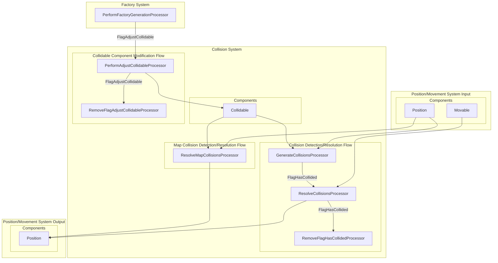

# Collision System

## Table of Contents  

[Purpose](#purpose)

[Interaction with Other Systems](#interaction-with-other-systems)

[Components](#components)

 * [Collidable](#the-collidable-component)
   * [Combination of Attributes and Behavior](#combination-of-attributes-and-the-behavior)
   * [Examples](#examples)

 * [FlagHasCollided](#the-flaghascollided-component)
 * [FlagAdjustCollidable](#the-flagadjustcollidable-component)

[Processors](#processors)

 * [Entity Collision Detection and Resolution Flow](#entity-collision-detection-and-resolution-flow)
   * [GenerateCollisionsProcessor](#the-generatecollisionsprocessor-processor)
   * [ResolveCollisionsProcessor](#the-resolvecollisionsprocessor-processor)
   * [RemoveFlagHasCollidedProcessor](#the-removeflaghascollidedprocessor-processor)

 * [Collidable Component Modification Flow](#collidable-component-modification-flow)
   * [PerformAdjustCollidableProcessor](#the-performadjustcollidableprocessor-processor)
   * [RemoveFlagAdjustCollidableProcessor](#the-removeflagadjustcollidableprocessor-processor)

 * [Map Collision Detection and Resolution Flow](#map-collision-detection-and-resolution-flow)
   * [ResolveMapCollisionsProcessor](#the-resolvemapcollisionsprocessor-processor)


## Purpose
The aim of the *Collision System* is to identify collisions among `Collidable` entities, fix the `Position` after the collision and provide the information to other systems that entity has collided with other entity.

## Interaction with Other Systems
The *Collision System* is vital for other systems to work. Without the knowledge if the collision occured and with what entity many game mechanism cannot exist - picking up items, damaging enemies, ...




When some `Collidable` entity collides with other `Collidable` entity, new `FlagHasCollided` component is generated and added on the entity that is a subject of the collision. This flag then serves as a trigger for the other systems.

## Components

### The `Collidable` Component
The `Collidable` component when assigned on an entity tells the game that entity is subject of collisions, i.e. can collide with other `Collidable` entities, i.e. components having `Collidable` component.

The parameters in `Collidable` component can be in detail seen in the code itself. Here, I would like to show how to achieve some useful real-game setting of collidable objects as a combination of those parameters.

#### Combination of Attributes and the Behavior

##### Allow/Deny Collisions
 * If Entity XYZ has `allowlist = {}` + `denylist = {}` = allow collision with *everybody* (DEFAULT)
 * If Entity XYZ has `allowlist = {}` + `denylist = {"ALL"}` = allow collision with *nobody*
 * If Entity XYZ has `allowlist = {1,2}` + `denylist = {}` = allow collision *only with entity 1 and 2*
 * If Entity XYZ has `allowlist = {}` + `denylist = {3,4}` = allow collision *with everybody except entity 3 and 4*

##### Allow/Deny Fixing Position of Other Entities
 * If Entity XYZ has `apply_pos_fix_to_allowlist = {}` + `apply_pos_fix_to_denylist = {}` = allow fixing of collision of *every* entity that collided with Entity XZY (DEFAULT)
 * If Entity XYZ has `apply_pos_fix_to_allowlist = {}` + `apply_pos_fix_to_denylist = {"ALL"}` = allow fixing of collision of *no entity* that collided with Entity XZY
 * If Entity XYZ has `apply_pos_fix_to_allowlist = {1,2}` + `apply_pos_fix_to_denylist = {}` = allow fixing of collision of *entities 1 and 2 only* that collided with Entity XZY
 * If Entity XYZ has `apply_pos_fix_to_allowlist = {}` + `apply_pos_fix_to_denylist = {3,4}` = allow fixing of collision of *every entity except 3 and 4* that collided with Entity XZY

##### Allow/Deny Fixing Position of the Entity
 * If Entity XYZ has `accept_pos_fix_from_allowlist = {}` + `accept_pos_fix_from_denylist = {}` = allow fixing of position of Entity XYZ in case it collides everyone (DEFAULT)
 * If Entity XYZ has `accept_pos_fix_from_allowlist = {}` + `accept_pos_fix_from_denylist = {"ALL"}` = disable fixing of position of Entity XYZ in case it collides anyone
 * If Entity XYZ has `accept_pos_fix_from_allowlist = {1,2}` + `accept_pos_fix_from_denylist = {}` = allow fixing of position of Entity XYZ in case it collides with *entities 1 and 2 only* 
 * If Entity XYZ has `accept_pos_fix_from_allowlist = {}` + `accept_pos_fix_from_denylist = {3,4}` = allow fixing of position of Entity XYZ in case it collides *every entity except 3 and 4* 

#### Examples

##### Lava
Let's consider Lava as an danger-zone entity that the player can walk on and get the damage from it. At the same time the NPCs would omit collision with the Lava simply because they cannot walk on it.

To achieve the above, we would need to introduce the following configuration.

```
{
  "id" : "LAVA",
  "templates" : [],
  "components" : [

    {
      "type" : "new.position:Position", 
      "params" : {
        "x" : 300, 
        "y" : 300, 
        "map" : "test_arena_sand"
      }
    },

    {
      "type" : "new.collidable:Collidable", 
      "params" :  {
        "x" : 100, 
        "y" : 100, 
        "dx" : 0, 
        "dy" : 8
      }
    }
  ]
}
```
> :warning: **_NOTE_**: Lava *MUST NOT* have `Movable` component. Otherwise, it will be moved by after collision with the player.

```
{
  "id" : "PLAYER",
  "templates" : ["new/model/body/male/human/white"],
  "components" : [

    {
      "type" : "new.position:Position", 
      "params" : {
        "x" : 250, "y" : 250, "map" : "test_arena_sand"
      }
    },

    {
      "type" : "new.movable:Movable",
      "params" :  {
        "velocity" : 200
      }
    },

    {
      "type" : "new.collidable:Collidable", 
      "params" :  {
        "x" : 15, "y" : 27, 
        "dx" : 0, "dy" : 8,
        "accept_pos_fix_from_denylist" : ["LAVA"] // LAVA cannot move the player
      }
    }
  ]
}
```
> **_NOTE_**: Player must state LAVA in the `accept_pos_fix_from_denylist`. Otherwise, it will not be able to walk on the lava. At the same moment note that LAVA is not specified in the `denylist`. If it were there, no collision with Lava will be detected and hence no damage on Player would be generated. Precondition for damage generation is collision.

```
{
  "id" : "NPC",
  "templates" : ["new/model/body/male/skeleton/green"],
  "components" : [

    {
      "type" : "new.position:Position", 
      "params" : {
        "x" : 219, "y" : 800, "map" : "test_arena_sand"
      }
    },

    {
      "type" : "new.movable:Movable", 
      "params" :  {
        "velocity" : 100
      }
    },

    {
      "type" : "new.collidable:Collidable", 
      "params" :  {
        "x" : 15, "y" : 27, "dx" : 0, "dy" : 8,
        "accept_pos_fix_from_denylist" : []  // this is also default value so can be omitted
      }
    }
  ]
}
```
> **_NOTE_**: The NPC is allowing LAVA entity to correct its position by not putting anything on `accept_pos_fix_from_denylist`.

##### Stone
Let's imagine that we want to implement Stone entity, i.e. entity that can be moved only by Player and no other entity can move the stone.

In such case, we need to set following parameters on the `Collidable` component of the Stone entity `accept_pos_fix_from_allowlist = {"player"}` + `position_fix_walkaround_mode = False`

```
{
  "id" : "STONE",
  "templates" : [],
  "components" : [

    {
      "type" : "new.position:Position", 
      "params" : {"x" : 300, "y" : 10, "map" : "test_arena_sand"}
    },

    {
      "type" : "new.movable:Movable", 
      "params" :  {"velocity" : 100}
    },

    {
      "type" : "new.collidable:Collidable", 
      "params" :  {
        "x" : 15, "y" : 15, 
        "dx" : 0, "dy" : 8,
        "accept_pos_fix_from_allowlist" : ["player01"], // can be moved only by player
        "position_fix_walkaround_mode" : false // can be pushed only straight
      }
    }
  ]
}
```
##### Player
The Player as the entity controlled by the real person does not need to be pushed by other entities after collisions. To achieve that effect it is possible to tell the Player to forbid all entities to move him by `accept_pos_fix_from_denylist = {"ALL"}`.

```
{
  "id" : "PLAYER",
  "templates" : ["new/model/body/male/human/white"],
  "components" : [

    {
      "type" : "new.position:Position", 
      "params" : {
        "x" : 250, "y" : 250, "map" : "test_arena_sand"
      }
    },

    {
      "type" : "new.movable:Movable",
      "params" :  {
        "velocity" : 200
      }
    },

    {
      "type" : "new.collidable:Collidable", 
      "params" :  {
        "x" : 15, "y" : 27, 
        "dx" : 0, "dy" : 8,
        "accept_pos_fix_from_denylist" : ["ALL"] // noone can move the player
      }
    }
  ]
}
```

### The `FlagHasCollided` Component

### The `FlagAdjustCollidable` Component

## Processors
The *Collision System* consists of several processors. Some of those processors are standalone, others need to be planned in a given sequence/ flow.

* **Entity Collision Detection and Resolution Flow**
The main logic is implemented by the following sequence of processors.

  ```mermaid
  flowchart LR
    GenerateCollisionsProcessor-->ResolveCollisionsProcessor-->RemoveFlagHasCollided
  ```
  This flow ensures that collisions are identified and positions are correctly fixed.

* **Collidable Component Modification Flow**
This flow serves for adjusting `Collidable` component on entities that are generated by *Factory System*, such as projectiles.

  ```mermaid
  flowchart LR
    PerformAdjustCollidableProcessor-->RemoveFlagAdjustCollidableProcessor
  ```

* **Map Collision Detection and Resolution Flow**
Fixing the collision with the map tiles is handled by individual separate processor - the`ResolveMapCollisionsProcessor`.

### Entity Collision Detection and Resolution Flow
In order to be noticed by the *Collision System* the entity must have `Collidable` component. This component specifies that the entity can collide and can further specifies with what entities it can/cannot collide and how the entity should behave upon the collision (if and how it should correct its position or not).


The fact that the entity has collided with some other entity is marked by the temporary component `FlagHasCollided`. Other systems that need to know whether entity has touched something or not are looking for this component on entity.

At the end of the game cycle, `FlagHasCollided` is removed so that in the next game cycle another new collision detection can happen.

#### The `GenerateCollisionsProcessor` Processor


This processors looks for entities that can collide - i.e. entities having `Position` and `Collidable` component. Then it tests whether collision occured and if yes, assigns the `FlagHasCollided` to the entity. This component bears all the details about the collisions (list of `Collision` objects) such as entity that is subject of collision and correction vector - vector that, if applied on the entity, fixes entity's position so that collision is omitted. This correction vector is used in `ResolveCollisionsProcessor` to fix the `Position` if required.

The correction vector calculation is demonstrated on the following schema.


> **_NOTE:_** This processor has several versions - one that tests collisions only for entities displayed on the screen, other that tests for collision also not displayed components.

#### The `ResolveCollisionsProcessor` Processor


The aim of this processor is to fix the overlaps that occured on collided entities. Overlaps and correction vectors have been previously calculated and recorded by `GenerateCollisionsProcessor` into `FlagHasCollided` component.

The `ResolveCollisionsProcessor` simply corrects the position of collided entity based on the specifics defined in `Collidable` component and extracted into `Collision` object - list of `Collision` objects is part of the `FlagHasCollided` attributes.

There might be several approaches to fixing of the position. The most simple is to apply the correction vector to the entity position. But this is causing jumps in the game.

The more realistic approach is to perform the correction only on one axis, i.e. take only one dimension of the vector and apply it. This will cause more realistic bahavior without skipping.

The `ResolveCollisionsProcessor` also takes into account specific attributes of `Collidable` component passed in `FlagHasCollided`- `accept_fix` and `allow_fix`. Those attributes are further determining if the position correction should happen or not (see chapter about `Collidable` component for more details).

> **NOTE:** Same as `GenerateCollisionsProcessor` also this processor might have several versions. Each version can implement different position fixing algorithms - for example how 2 entities should walk around each other.

#### The `RemoveFlagHasCollidedProcessor` Processor


The aim of the `RemoveFlagHasCollidedProcessor` is simply to remove the sigh that the entity has collided from the entity. So that in the next game cycle entity is being handled as free-of-collisions and the `GenerateCollisionsProcessor` can again perform new check on collision again.

### Collidable Component Modification Flow

This flow is dependent on the *Factory System* that generates the trigger flag `FlagAdjustCollidable`. This flag indicates that the newly generated entity from the factory need some adjustment of its `Collidable` component. For example: 
* Arrow entity collidable zone needs to be adjusted based on the player experience points.
* Arrow entity must ignore player entity for collisions. Otherwise, player might be damaged by its own arrow (when arrow is generated, collision zone of the arrow and the player probably overlap and there will be collision detected unless arrow ignores the player).


The flow simply modifies the `Collidable` component based on data contained in `FlagAdjustCollidable` and eventually discards the flag component at the end of the game cycle.

#### The `PerformAdjustCollidableProcessor` Processor

The *Factory System* generates the `FlagAdjustCollidable` as shown on the picture below in order to modify the features of the newly generated entity.


The `PerformAdjustCollidableProcessor` simply takes the modification requests contained in the `FlagAdjustCollidableComponent` and performs the changes.


As the result `Collidable` component is modified. Usually by adding some more entities to be ignored or changing its collision areas.

#### The `RemoveFlagAdjustCollidableProcessor` Processor


At the end of the game cycle, temporary flag `FlagAdjustCollidable` must be removed from the entity. Otherwise, the `Collidable` component will be modified again in the next game cycle which would lead to unwanted behavior of the collidable entity.

### Map Collision Detection and Resolution Flow

To make things simple, map collisions are handled differently from entity collisions. If the `ResolveMapCollisionsProcessor` detects that the possition of the entity represented by `Position` and `Collidable` entity colides with the map (wall), the entity's position is changed to the last position before this collision happened.

#### The `ResolveMapCollisionsProcessor` Processor

Single processor looking for entities that have `Position` and `Collidable` component and performing check against the map. If collision is detected, `Position` of the entity is changed to the last correct position.
